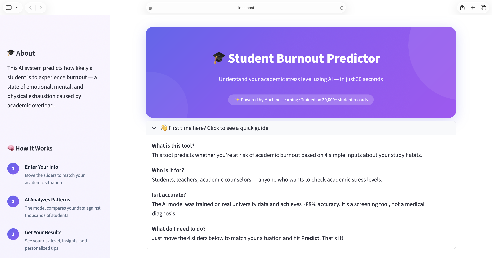
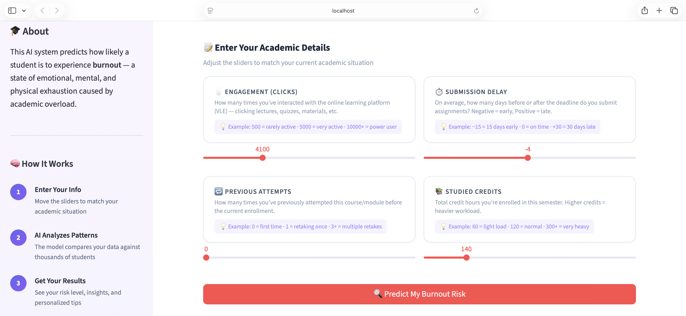
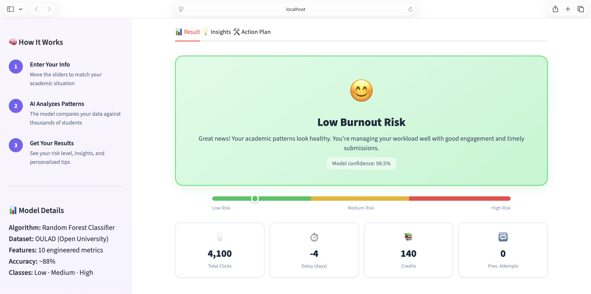
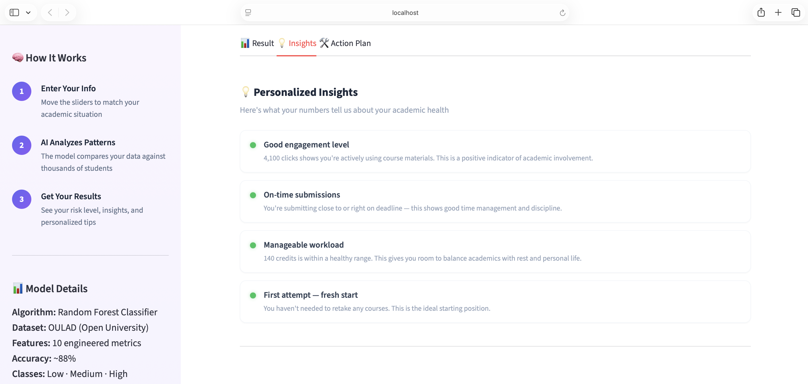
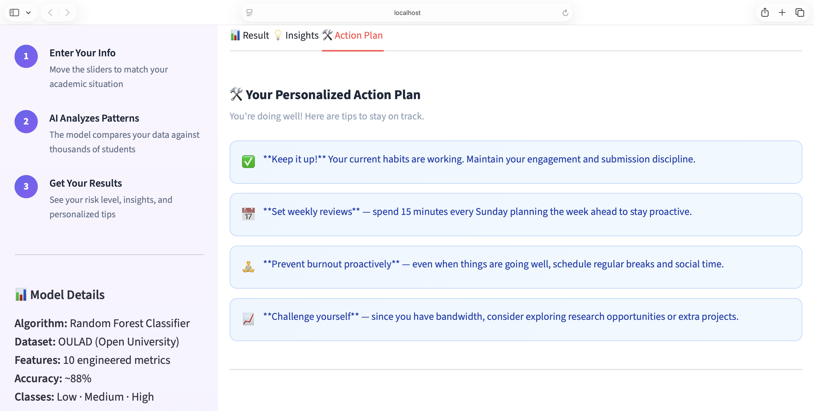
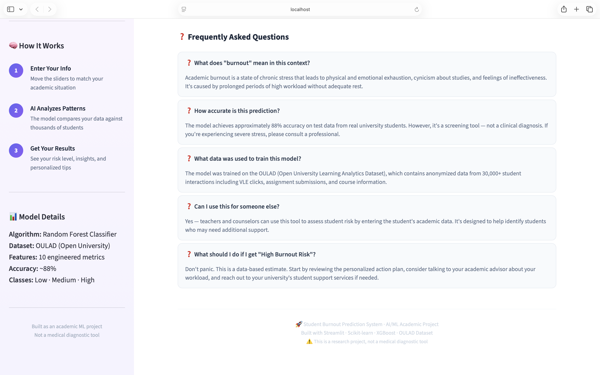

# 🎓 Student Burnout Prediction System

An end-to-end Machine Learning project that predicts student burnout risk levels (Low, Medium, High) based on academic behavior, engagement, and performance patterns. Built with a complete pipeline from data preprocessing to a deployed Streamlit web application.


---

## 📸 Screenshots

### Hero & Quick Guide


### Input Section


### Prediction Result


### Personalized Insights


### Action Plan


### FAQ & Footer


---

## 🔍 Problem Statement

Academic burnout is a growing concern in educational institutions worldwide. Students experiencing burnout show decreased engagement, poor academic performance, and deteriorating mental health. Early identification of burnout risk can enable timely intervention by educators and counselors.

**This project addresses the question:** *Can we predict a student's burnout risk using their academic behavior data?*

---

## 🧠 How It Works

```
📂 Raw Data (4 CSVs)
    ↓
🔗 Data Integration (Merge on student/course/assessment IDs)
    ↓
🧹 Data Preprocessing (Handle missing values, clean data)
    ↓
⚙️ Feature Engineering (10 behavioral features)
    ↓
🎯 Target Variable Creation (Burnout score → 3 classes via pd.qcut)
    ↓
📊 Model Training (4 classifiers compared)
    ↓
✅ Model Evaluation (Accuracy, Precision, Recall, F1, Confusion Matrix)
    ↓
🚀 Deployment (Streamlit Web App)
```

---

## 📁 Project Structure

```
Student-Burnout-Prediction/
├── app.py                        # Streamlit web application
├── model.pkl                     # Trained Random Forest model
├── Student_Burnout_Predictor.ipynb  # Complete ML pipeline notebook
├── requirements.txt              # Python dependencies
├── README.md                     # This file
├── screenshots/                  # App screenshots
│   ├── home.png
│   ├── result.png
│   ├── insights.png
│   └── action_plan.png
└── data/                         # Dataset files
    ├── studentVle.csv            # Student VLE engagement data
    ├── studentAssessment.csv     # Assignment submission data
    ├── assessments.csv           # Assessment metadata
    └── studentInfo.csv           # Student background info
```

---

## 📊 Dataset

The project uses the **OULAD (Open University Learning Analytics Dataset)**, a publicly available educational dataset containing anonymized data from 30,000+ students.

| File | Description | Key Columns |
|------|-------------|-------------|
| `studentVle.csv` | Platform engagement data | `id_student`, `sum_click` |
| `studentAssessment.csv` | Assignment submissions | `id_student`, `date_submitted`, `score` |
| `assessments.csv` | Assessment details | `id_assessment`, `date`, `weight` |
| `studentInfo.csv` | Student demographics | `id_student`, `num_of_prev_attempts`, `studied_credits` |

**Source:** [OULAD on Kaggle](https://www.kaggle.com/datasets/anlgrbz/student-demographics-online-education-dataoulad) and place the CSV files in a `dataset/` folder.

> 📥 `studentVle.csv` is too large for GitHub (~430MB) so couldn't upload it here.

---

## ⚙️ Feature Engineering

10 features were engineered from the raw data:

| Feature | Description | Source |
|---------|-------------|--------|
| `sum_click` | Total VLE interactions | studentVle |
| `submission_delay` | Days between deadline and submission | studentAssessment + assessments |
| `delay_abs` | Absolute submission delay | Derived |
| `engagement_level` | Categorized engagement (0/1/2) | Derived from sum_click |
| `engagement_per_day` | Click intensity per attempt | Derived |
| `delay_ratio` | Relative delay behavior | Derived |
| `click_intensity` | Engagement vs workload ratio | Derived |
| `activity_score` | Combined engagement metric | Derived |
| `num_of_prev_attempts` | Previous course attempts | studentInfo |
| `studied_credits` | Total enrolled credits | studentInfo |

---

## 🎯 Target Variable

Since the dataset doesn't contain burnout labels, a synthetic target was created:

```python
# Burnout score = low engagement + high delay + noise
score = (sum_click.rank(pct=True) * -1 +
         submission_delay.rank(pct=True) +
         np.random.rand(n) * 0.3)

# Convert to 3 balanced classes
burnout_risk = pd.qcut(score, q=3, labels=[0, 1, 2])
```

| Class | Label | Description |
|-------|-------|-------------|
| 0 | 🟢 Low Burnout | Healthy academic patterns |
| 1 | 🟡 Medium Burnout | Some stress signals present |
| 2 | 🔴 High Burnout | Significant burnout indicators |

---

## 📈 Models & Results

Four classifiers were trained and compared:

| Model | Accuracy |
|-------|----------|
| Logistic Regression | ~87% |
| Decision Tree | ~85% |
| **Random Forest** | **~88%** |
| **XGBoost** | **~88%** |

**Random Forest** was selected as the final model (200 estimators, max_depth=10).

**Evaluation Metrics:** Accuracy, Precision, Recall, F1-Score, Confusion Matrix

---

## 🚀 Getting Started

### Prerequisites

- Python 3.8 or higher
- pip (Python package manager)

### Installation

```bash
# 1. Clone the repository
git clone https://github.com/Alvira-Parveen/Student-Burnout-Prediction.git
cd Student-Burnout-Prediction

# 2. Install dependencies
pip install -r requirements.txt

# 3. Run the app
streamlit run app.py
```

The app will open in your browser at `http://localhost:8501`

### Running the Notebook

To reproduce the full ML pipeline:

1. Open `Student_Burnout_Predictor.ipynb` in Google Colab or Jupyter
2. Upload the dataset files to the appropriate path
3. Run all cells sequentially

---

## 🖥️ App Features

- **Interactive Input** — 4 sliders with plain-English explanations and examples
- **AI Prediction** — Real-time burnout risk classification with confidence score
- **Visual Gauge** — Color-coded risk meter (green → yellow → red)
- **Personalized Insights** — Dynamic analysis of each input parameter
- **Action Plan** — Tailored recommendations based on risk level
- **FAQ Section** — Answers common questions for non-technical users
- **Responsive Design** — Custom CSS with gradient UI and hover effects

---

## 🛠️ Tech Stack

| Category | Technology |
|----------|------------|
| Language | Python 3.8+ |
| ML Libraries | scikit-learn, XGBoost, pandas, NumPy |
| Visualization | Matplotlib |
| Deployment | Streamlit |
| Model Serialization | Joblib |
| Data Processing | pandas, NumPy |

---

## 🔮 Future Improvements

- Add psychological/behavioral survey features as inputs
- Implement deep learning models (LSTM for temporal patterns)
- Deploy online via Streamlit Cloud / Hugging Face Spaces
- Add student login and longitudinal tracking
- Integrate with university LMS APIs for real-time data

---

## 👤 Author

**Name**: ALVIRA PARVEEN  
🔗 [LinkedIn](https://www.linkedin.com/in/alvira-parveen-78022536b)  
🌐 [GitHub](https://github.com/Alvira-Parveen)

---

## 📄 License

This project is licensed under the MIT License — see the [LICENSE](LICENSE) file for details.

---

## ⚠️ Disclaimer

This is an academic research project and **not a medical diagnostic tool**. The predictions are based on statistical patterns in academic data and should not be used as a substitute for professional mental health assessment. If you or someone you know is experiencing burnout or mental health difficulties, please consult a qualified professional.
